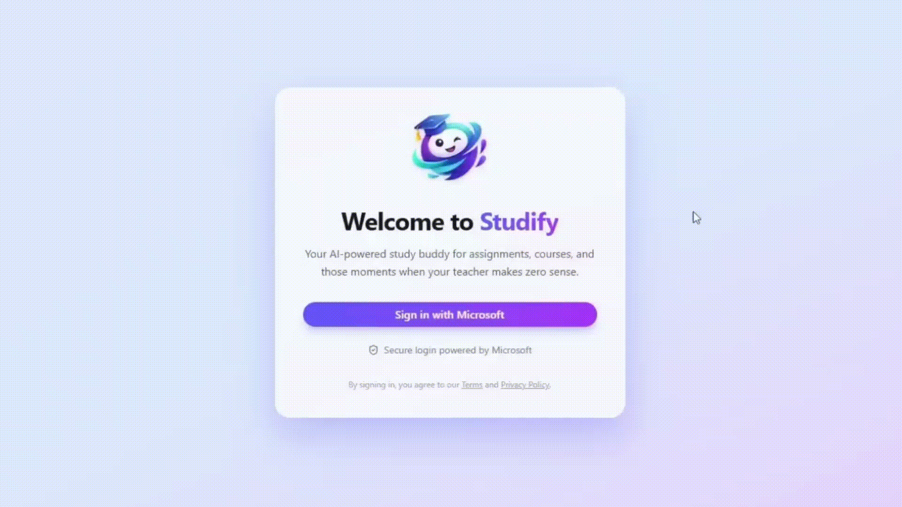
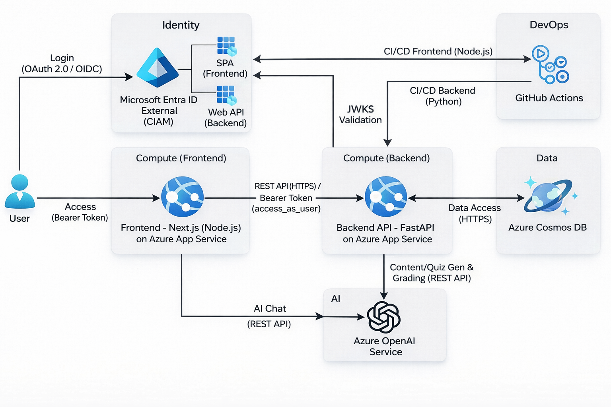

#  Studify

**Studify** is an end-to-end AI learning platform that helps learners go from **zero to mastery** in any subject through structured courses, AI-generated lessons, adaptive quizzes, and an optional interactive AI tutor — all secured with **Microsoft Entra ID External (CIAM)** authentication.

It is designed to feel like a **personalised digital classroom**: you define what you want to learn, and the platform builds, teaches, tests, and guides you step-by-step.

---

## 🧭 How It Works (End-to-End Experience)

### 🔐 Secure Login with Microsoft Entra ID

Users sign in using **Microsoft Entra External ID (CIAM)**. Authentication is handled via OAuth 2.0 / OpenID Connect, ensuring enterprise-grade security from the very first interaction.

### 📚 Create AI-Generated Courses in Seconds

Users can create a new course by specifying:
- **Subject**
- **Subtopics**
- **Difficulty level**



After login, users land on their **dashboard**, where they can view all existing courses or start a new one.

---

### 🧠 AI-Generated Lessons with an Interactive Tutor

Studify uses AI to generate a **structured curriculum** tailored to the learner's intent and skill level.

Learners can optionally enable an **AI Tutor**, which opens in a split-screen layout. The tutor can:

- Answer questions about the lesson
- Clarify confusing concepts
- Accept text and image input


---

### 📝 Adaptive Quizzes to Test Understanding

After completing a lesson, users can generate a **quiz** to test their understanding.  
Questions are dynamically created based on lesson content and learning objectives.


---

### ✅ AI Grading with Actionable Feedback

Once submitted, quizzes are:
- Automatically graded by AI
- Evaluated for correctness and reasoning
- Annotated with **helpful feedback and improvement advice**

For incorrect answers, Studify explains:
- Why the answer is wrong
- What the correct approach is
- How to avoid similar mistakes in the future


---

## ✨ Features

- AI-generated lesson plans and structured curricula
- Dynamic lesson generation and section expansion
- Adaptive quizzes with AI grading
- Progress tracking
- Optional AI Tutor chat (text + image input)
- Secure authentication & authorisation with Microsoft Entra External ID

---

## 📁 Repository Structure

```text
.
├── backend/
│   ├── api.py                     # FastAPI entry point
│   ├── learning_platform.py       # Core orchestration layer
│   ├── requirements.txt
│   ├── documentation/
│   │   └── postman.md              # API collection notes
│   ├── lesson_plans/
│   │   └── lesson_plan_service.py
│   ├── lessons/
│   │   └── lesson_service.py
│   ├── quizzes/
│   │   └── quiz_service.py
│   ├── progress/
│   │   └── progress_service.py
│   ├── users/
│   │   ├── auth.py                 # Entra ID JWT validation
│   │   └── user_creation.py
│   └── shared/
│       ├── models.py               # Pydantic models
│       ├── cosmos_client.py        # Azure Cosmos DB client
│       ├── openai_client.py        # OpenAI wrapper
│       └── cosmos-rbac-guide.md
│
├── frontend/
│   ├── README.md
│   ├── next.config.ts
│   ├── next-env.d.ts
│   ├── public/
│   └── src/
│       ├── app/
│       │   ├── api/tutor-chat/route.ts
│       │   ├── layout.tsx
│       │   ├── ClientLayout.tsx
│       │   └── page.tsx
│       ├── components/
│       │   ├── Platform.tsx        # Main app UI
│       │   ├── AITutorChat.tsx
│       │   ├── LoginPage.tsx
│       │   └── views/
│       │       ├── CreateCourseView.tsx
│       │       ├── LessonView.tsx
│       │       ├── QuizView.tsx
│       │       └── QuizResultView.tsx
│       ├── lib/
│       │   ├── authConfig.ts        # MSAL configuration
│       │   └── msalInstance.ts
│       └── types/
│           └── api.ts
│
└── README.md
```

---

## 🧠 Architecture Overview



The system consists of a **FastAPI backend** and a **Next.js (App Router) frontend**, secured using **Microsoft Entra ID External (CIAM)**.

- **Frontend**: Next.js (React, App Router) using `@azure/msal-react`
- **Backend**: FastAPI with JWT validation via Microsoft Entra External ID
- **Auth**: OAuth2 / OpenID Connect (Authorisation Code + PKCE)
- **Storage**: Azure Cosmos DB
- **AI**: Azure OpenAI APIs for content generation and grading

---

#### Environment Variables (Backend)

```env
COSMOS_DB_ENDPOINT=<endpoint-name>
AZURE_OPENAI_ENDPOINT=https://<endpoint-name>.cognitiveservices.azure.com/
AZURE_OPENAI_KEY=<api-key>
DEPLOYMENT_NAME=<deployment-name>

TENANT_ID=<your-tenant-id>
CLIENT_ID=<backend-app-client-id>
```

#### Environment Variables (Frontend)

```env
NEXT_PUBLIC_AZURE_CLIENT_ID=<frontend-client-id>
NEXT_PUBLIC_AZURE_AUTHORITY=https://<TENANT_ID>.ciamlogin.com/<TENANT_ID>
NEXT_PUBLIC_AZURE_KNOWN_AUTHORITY=<TENANT_ID>.ciamlogin.com
NEXT_PUBLIC_AZURE_REDIRECT_URI=http://localhost:3000
NEXT_PUBLIC_API_SCOPE=api://<BACKEND_CLIENT_ID>/access_as_user
AZURE_OPENAI_ENDPOINT=<openai-api-endpoint>
AZURE_OPENAI_KEY=<api-key>
DEPLOYMENT_NAME=<deployment-name>
```

## 🚀 Local Development Setup

### Prerequisites

- Node.js 18+
- Python 3.14+
- Azure Entra External ID tenant
- Azure Cosmos DB
- OpenAI API key

---

### Backend Setup

```bash
cd backend
python -m venv .venv
source .venv/bin/activate
pip install -r requirements.txt
uvicorn api:app --reload --port 8000
```

API will be available at:

```
http://localhost:8000
http://localhost:8000/docs
```

---

### Frontend Setup

```bash
cd frontend
npm install
npm run dev
```

Frontend will be available at:

```
http://localhost:3000
```

---

## 🧪 API Testing

- Swagger UI: `/docs`
- Postman notes: `backend/documentation/postman.md`

---

## ⚠️ Production Notes

- Restrict CORS origins
- Cache JWKS keys with rotation support
- Use HTTPS everywhere
- Store secrets in Azure Key Vault
- Enable conditional access policies in Entra ID

---

## 📜 Licence

This project is licensed under the terms of the [MIT Licence](LICENSE).